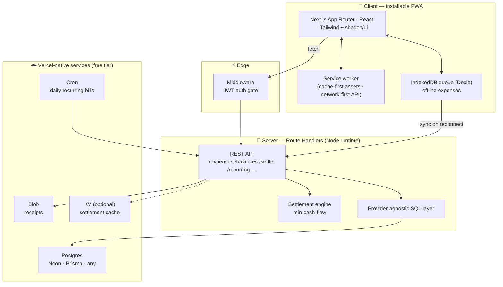

<div align="center">

# 💸 BILL SPILT

**Split shared bills with your roommates — see who owes what and settle up with the fewest payments, right from your phone.**

An installable, offline-capable Progressive Web App built on Next.js 16 + React 19, deployed entirely on Vercel's free tier. Free forever, no premium tiers.

[**▶ Live demo**](https://billspilt.com)


</div>

---

## Why it's interesting

BILL SPILT isn't a CRUD demo. The hard parts are the parts users never see:

- **A settlement engine** that collapses a tangle of IOUs into the minimum number of payments.
- **Offline-first writes** that queue in the browser and reconcile when the network returns.
- **A provider-agnostic data layer** that runs on Neon, Prisma Postgres, or any standard Postgres without code changes.
- **Money math that always balances to the cent**, even with uneven splits.

It's designed mobile-first (44px touch targets, bottom-sheet forms, swipe-to-delete), installs to the home screen, and works on a plane.

---

## Features

| | |
|---|---|
| 🧾 **Log expenses in seconds** | Description, amount, category, and a split type — equal, exact, or percentage. |
| ⚖️ **Instant balances** | Home screen shows each person's net position (green = owed, red = owes), plus pairwise "what you owe X". |
| 🤝 **Smart settle-up** | Min-cash-flow algorithm turns every debt into a short "A pays B $X" list, with history + undo. |
| 💳 **Ways to pay** | Each roommate shares Venmo / Cash App handles — shown (with deep links + copy) when you owe them. |
| 👑 **Household admin** | Owner role can rename, remove members, transfer ownership, and settle everyone in one tap. Activity log included. |
| 🔁 **Recurring bills** | Rent, internet, subscriptions auto-logged daily by a Vercel Cron job. |
| 📸 **Receipt photos** | Attach a photo to any expense (Vercel Blob). |
| 🔎 **Search & filter** · 📤 **CSV export** | Find expenses by text/category; download the full ledger any time. |
| 🔐 **Auth + password reset** | Credentials auth with a self-serve email reset flow (SMTP). |
| 📴 **Full offline support** | Add expenses offline; they sync automatically on reconnect. |
| 📲 **Installable PWA** | Standalone display, app icons, dark mode, install prompt, home-screen shortcuts. |

---

## Architecture



---

## Engineering highlights

### 1. Settlement as a graph-reduction problem
Naively, *n* roommates can owe each other up to *n²* ways. `minimizeTransfers` ([`lib/settlement.ts`](lib/settlement.ts)) reduces this to net balances, then greedily matches the largest creditor against the largest debtor each round — guaranteeing **at most _n − 1_ transfers** for _n_ people, and in practice a far shorter list. All arithmetic runs in integer cents to eliminate floating-point drift.

### 2. Money that always reconciles
Splitting `$40.00` three ways is `13.34 / 13.33 / 13.33`, not `13.333…`. `computeSplits` distributes remainder cents deterministically so the parts **always sum back to the total** — for equal, exact-amount, and percentage splits alike. Inputs are validated server-side before anything is written.

### 3. Offline-first with conflict-free sync
Expenses created offline are written to **IndexedDB** (Dexie) and flagged unsynced. A `online` listener and focus revalidation flush the queue to the API, removing each record only on a confirmed `2xx`. The UI surfaces an `OfflineBanner` with the pending count, and even a request that dies mid-flight falls back to the local queue ([`lib/sync.ts`](lib/sync.ts), [`lib/offline-db.ts`](lib/offline-db.ts)).

### 4. A data layer that doesn't care who hosts Postgres
Managed Postgres providers disagree on connection semantics (Neon speaks HTTP, others want TCP; pooled vs. direct strings). Instead of locking to one, the `sql` helper in [`lib/db.ts`](lib/db.ts) **selects a backend from the connection host** — Neon's serverless HTTP driver for `*.neon.tech`, standard `pg` over TCP for everything else — behind one tagged-template interface returning `{ rows, rowCount }`. The same build runs on Neon, Prisma Postgres, Supabase, or RDS unchanged.

### 5. Atomic writes without interactive transactions
The HTTP SQL path runs one statement per request, so there's no `BEGIN`/`COMMIT`. An expense + its N splits are written **atomically in a single CTE statement** that `INSERT … RETURNING`s the new expense id and fans it out across `jsonb_to_recordset` for the split rows — one round trip, all-or-nothing.

### 6. Auth and security
NextAuth v5 (Credentials) with **bcrypt-hashed passwords**, stateless **JWT sessions**, and an **Edge middleware** gate that's intentionally scoped to page routes only — API routes self-authorize and return JSON `401`s rather than HTML redirects. Every query is parameterized; the schema **bootstraps itself idempotently** on first request (no migration step to forget). The cron endpoint is protected by a bearer secret.

---

## Tech stack

Every dependency is free and Vercel-native — the whole app runs at $0.

| Concern | Choice |
| --- | --- |
| Framework | **Next.js 16** (App Router) · **React 19** · **TypeScript** (strict) |
| UI | **Tailwind CSS** · **shadcn/ui** · **Framer Motion** (swipe gestures, sheets) |
| Database | **Postgres** — Neon HTTP **or** `pg` TCP, auto-selected by host |
| File storage | **Vercel Blob** (receipt photos) |
| Cache | **Vercel KV** — optional, degrades gracefully |
| Auth | **NextAuth.js v5** (Credentials, JWT, bcrypt) + SMTP password reset (**nodemailer**) |
| Background jobs | **Vercel Cron** (`vercel.json`) |
| Offline / PWA | **Serwist** service worker · **Dexie.js** (IndexedDB) |
| Monetization | **Google AdSense** (Auto ads) with a self-served house-ad fallback |

No Supabase, Stripe, Resend, or Firebase — email uses your own mailbox over SMTP.

---

## Getting started

```bash
npm install
npm run dev          # http://localhost:3000
```

The service worker is disabled in dev; PWA behaviour is active in production builds.

```bash
npm run build        # production build
npm run lint         # ESLint (zero warnings)
npx tsc --noEmit     # type-check (clean)
npm run icons        # regenerate PWA icons (dependency-free generator)
```

### Environment

Copy `.env.example` → `.env.local`. The Postgres / Blob / KV variables are injected automatically when you link those stores in the Vercel dashboard. Set by hand:

- `AUTH_SECRET` — `openssl rand -base64 32`
- `CRON_SECRET` — any random string; protects the cron endpoint.

The database **schema creates itself** on first request via `ensureSchema()` — no migrations to run.

---

## Deploying to Vercel

1. Import the repo in Vercel.
2. **Storage** → add **Postgres** and **Blob** (and optionally **KV**); env vars are wired in automatically.
3. Add `AUTH_SECRET` and `CRON_SECRET`.
4. Deploy. `vercel.json` registers a daily run of `/api/cron/recurring`.

---

## Project structure

```
app/
  (auth)/login · (auth)/register        Credentials auth screens
  (app)/home · expenses · settle · stats  Four bottom-nav tabs
  api/                                  REST route handlers (Node runtime)
components/
  ui/                                   shadcn/ui primitives
  *                                     Feature components (sheets, swipe rows, charts)
lib/
  settlement.ts                         Min-cash-flow + split math
  db.ts                                 Provider-agnostic SQL layer
  expenses.ts                           Atomic expense + splits write
  queries.ts                            Read models & balance aggregation
  offline-db.ts · sync.ts               IndexedDB queue & sync
public/                                 manifest.json · generated icons · service worker
scripts/generate-icons.mjs             Zero-dependency PNG icon generator
```

---

## License

Free to use. Built to stay free forever.
