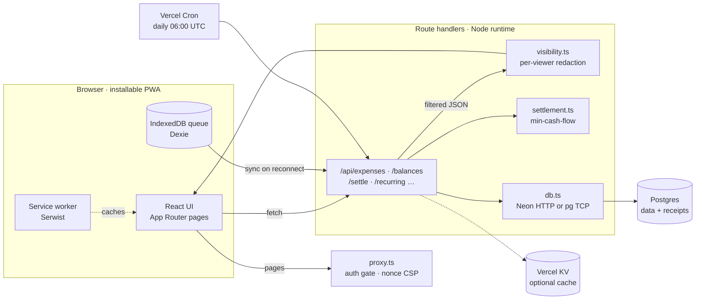

<div align="center">


# BillSpilt

**A shared-expense app for roommates that works offline, keeps each person's numbers private, and settles the house in the fewest possible payments.**


[**Live site**](https://billspilt.com) · [**Operations docs**](docs/operations.md)

<br/>


<br/>
<sub>Add an expense, watch balances update, settle up. Local build with sample data.</sub>

</div>

## Why I built it

Shared households run on rent, utilities and groceries, and keeping track of who owes whom quickly turns into a spreadsheet nobody trusts. BillSpilt keeps that ledger on everyone's phone, works when the signal drops, and reduces a tangle of pairwise debts to a short list of payments. It also treats spending as personal: the point is to show that each person paid their share, not to publish what everyone else spends.

## Highlights

- **Server-side privacy rules in one file.** [`lib/visibility.ts`](lib/visibility.ts) decides who may see each amount. Admins see every figure; members see only their own share, their own balances, and payments they are part of. API routes redact before the JSON is sent, so hidden figures never reach the browser's network tab. Redacted values come back as `null`, not `0`, so the UI shows "hidden" instead of a wrong number. Covered by 12 unit tests.
- **Fewest-payments settlement.** `minimizeTransfers` in [`lib/settlement.ts`](lib/settlement.ts) collapses up to *n²* pairwise debts into net balances, then greedily matches the largest creditor with the largest debtor: at most *n − 1* transfers. All math is in integer cents.
- **Splits that always add up.** `computeSplits` hands out remainder cents deterministically, so $40.00 three ways is 13.34 / 13.33 / 13.33 for equal, exact and percentage splits alike.
- **Atomic writes over a stateless HTTP driver.** With no `BEGIN`/`COMMIT` available, an expense and all its splits are written by one CTE that fans out via `jsonb_to_recordset`: one round trip, all or nothing ([`lib/expenses.ts`](lib/expenses.ts)).
- **Offline-first writes.** Expenses added offline go into an IndexedDB queue and sync on reconnect. A record leaves the queue only after a confirmed 2xx ([`lib/sync.ts`](lib/sync.ts)).
- **One database, any Postgres host.** [`lib/db.ts`](lib/db.ts) picks Neon's HTTP driver for `*.neon.tech` and `pg` over TCP for everything else, behind one tagged-template `sql` helper. Receipts live in the same database as `BYTEA`, so there is no second storage service.

## Features

| Area | What it does |
| --- | --- |
| **Expenses** | Equal, exact or percentage splits · receipt photo or PDF (downscaled to 1600px on the client) · search, category filters, CSV export |
| **Balances** | Your net position and what you owe each roommate, updated as expenses land |
| **Settle up** | "A pays B $X" plan with history and undo · Venmo and Cash App deep links · admin can settle everyone at once |
| **Privacy** | Members see only their own money; household totals and recurring-bill costs are admin-only; only the two people in a payment (or an admin) can record or undo it |
| **Recurring bills** | Fixed bills are logged by a daily Vercel Cron job; variable bills prompt for the real amount when due |
| **Households** | One-tap invite links · multiple admins · member management · activity log |
| **App** | Installable PWA · offline queue · dark mode · home-screen shortcuts · email password reset |

## Screenshots

<table>
<tr>
<td align="center" width="20%"><br/><sub><b>Balances</b><br/>admin view</sub></td>
<td align="center" width="20%"><br/><sub><b>Add expense</b><br/>four-way equal split</sub></td>
<td align="center" width="20%"><br/><sub><b>Expenses</b><br/>search and filters</sub></td>
<td align="center" width="20%"><br/><sub><b>Settle up</b><br/>with Venmo link</sub></td>
<td align="center" width="20%"><br/><sub><b>Stats</b><br/>admin view</sub></td>
</tr>
</table>

## Architecture


```mermaid
flowchart LR
    subgraph Client["Browser · installable PWA"]
        UI["React UI<br/>App Router pages"]
        IDB[("IndexedDB queue<br/>Dexie")]
        SW["Service worker<br/>Serwist"]
    end

    PX["proxy.ts<br/>auth gate · nonce CSP"]

    subgraph Server["Route handlers · Node runtime"]
        API["/api/expenses · /balances<br/>/settle · /recurring …"]
        VIS["visibility.ts<br/>per-viewer redaction"]
        SET["settlement.ts<br/>min-cash-flow"]
        DB["db.ts<br/>Neon HTTP or pg TCP"]
    end

    PG[("Postgres<br/>data + receipts")]
    KV[("Vercel KV<br/>optional cache")]
    CRON["Vercel Cron<br/>daily 06:00 UTC"]

    UI -->|pages| PX
    UI -->|fetch| API
    IDB -->|sync on reconnect| API
    SW -.->|caches| UI
    API --> SET
    API --> DB --> PG
    API -.-> KV
    API -->|filtered JSON| VIS --> UI
    CRON --> API
```

**Design decisions**

- **Redact on the server, not in the UI.** Hiding a number with CSS still ships it to the browser. Every route that returns money passes through `redactExpenses`, `redactTransfers`, `redactSettlements` or the recurring-bill redactors first. The same rule closes indirect leaks: recording a payment is limited to its two parties, so the "more than they owe" check cannot be used to probe someone else's balance.
- **Postgres for everything.** Data and receipt bytes share one database, so a deploy needs one free-tier store. The schema creates itself idempotently on first request; there are no migrations to run.
- **CTEs instead of transactions.** Neon's HTTP driver sends one statement per request. Writing an expense and its splits in one statement keeps it atomic without a connection pool.
- **Page-only auth gate.** [`proxy.ts`](proxy.ts) guards pages and sets a per-request nonce CSP with `'strict-dynamic'`. API routes authorize themselves and return JSON 401s instead of HTML redirects.
- **Health that tells the truth.** `/api/health` reports whether login and password reset actually work (database reachable, auth secret set, email provider accepting credentials), and provider failures are stored in the database so every instance sees them.

## Tech stack

| Layer | Choice |
| --- | --- |
| Framework | Next.js 16 (App Router), React 19, TypeScript (strict) |
| UI | Tailwind CSS, shadcn/ui on Radix, Framer Motion, Lucide icons |
| Data | PostgreSQL via `@neondatabase/serverless` or `pg`; Zod validation |
| Auth | NextAuth.js v5 (Credentials, JWT sessions, bcrypt) |
| Email | Resend or SMTP via Nodemailer |
| Offline | Serwist service worker, Dexie (IndexedDB) |
| Platform | Vercel hosting, Cron, optional KV |
| Testing | Vitest |

## Getting started

Requires Node.js and a PostgreSQL connection string.

```bash
git clone https://github.com/taylordrew4u2/Bill-Spilt.git
cd Bill-Spilt
npm install
cp .env.example .env.local   # set POSTGRES_URL and AUTH_SECRET at minimum
npm run dev                  # http://localhost:3000
```

The schema is created on first request. The service worker is off in development; PWA behavior runs in production builds (`npm run build && npm start`).

| Command | Purpose |
| --- | --- |
| `npm run dev` | Development server |
| `npm run build` / `npm start` | Production build and server |
| `npm run lint` | ESLint |
| `npm test` | Vitest suite |
| `npm run icons` | Regenerate PWA icons |
| `npm run set-password` | Reset a password directly in the database |
| `npm run migrate-receipts` | Move legacy Blob receipts into Postgres |

Environment variables, Vercel deployment, `/api/health` and the recovery scripts are covered in [docs/operations.md](docs/operations.md).

## Testing

```bash
npm test
```

70 tests across 8 files, colocated with the code they cover:

| File | Covers |
| --- | --- |
| `lib/settlement.test.ts` | Split math and minimum-transfer settlement |
| `lib/visibility.test.ts` | Who can see which amount, and who can settle |
| `lib/payments.test.ts` | Venmo and Cash App deep links |
| `lib/receipts.test.ts` | Receipt storage round-trips |
| `lib/credentials.test.ts`, `lib/email-health.test.ts` | Credential handling and email-provider health |
| `lib/utils.test.ts`, `app/api/auth/forgot/route.test.ts` | Formatting helpers and the forgot-password route |

## Project structure

```
app/
  (app)/          Home, expenses, settle and stats tabs
  (auth)/         Login, register, forgot and reset password
  api/            Route handlers (Node runtime)
  join/[code]/    One-tap invite entry
  guide/          Long-form guides for the marketing site
  sw.ts           Service worker
components/       Feature components; ui/ holds shadcn/ui primitives
lib/
  visibility.ts   Who may see which amount
  settlement.ts   Split and min-cash-flow math
  expenses.ts     Atomic expense + splits write
  db.ts           Driver selection and schema bootstrap
  sync.ts         Offline queue flush
proxy.ts          Auth gate and Content-Security-Policy
scripts/          Icon generator, password reset, receipt migration
docs/             Operations guide, screenshots, launch copy
```

---

<div align="center">
<sub>Built by Taylor Drew · <a href="https://github.com/taylordrew4u2">github.com/taylordrew4u2</a></sub>
</div>
