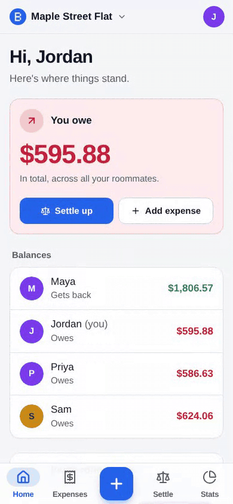
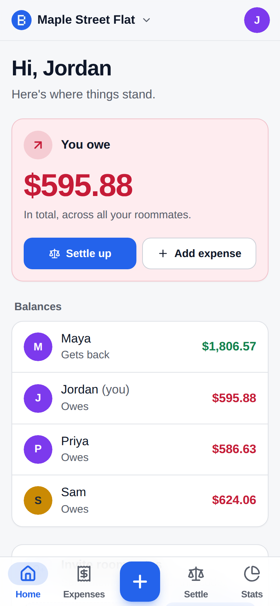
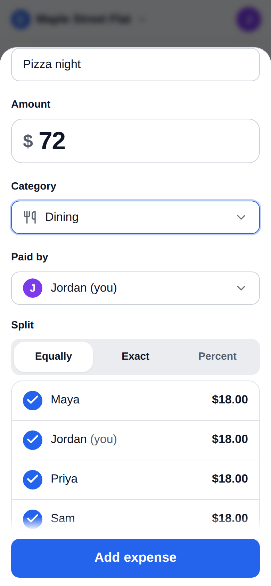
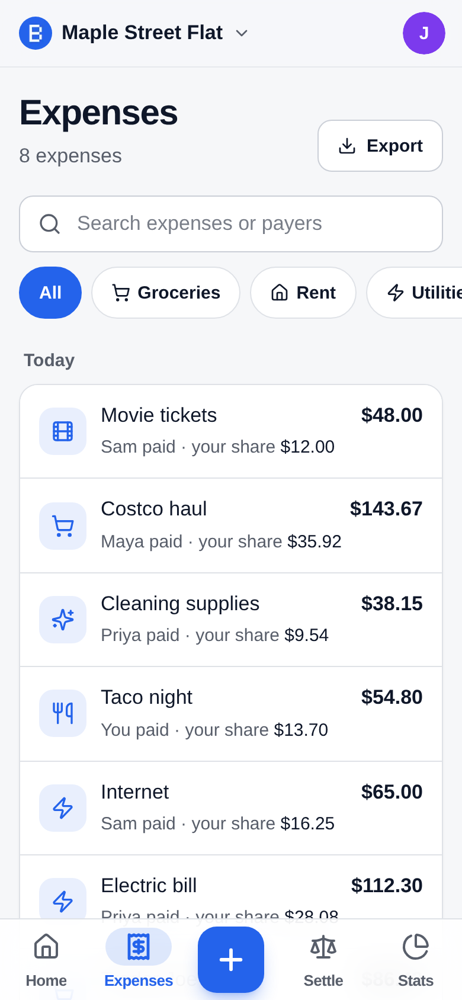
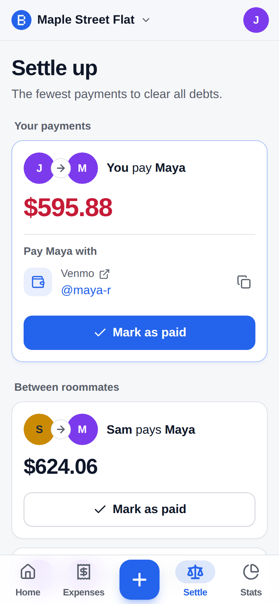
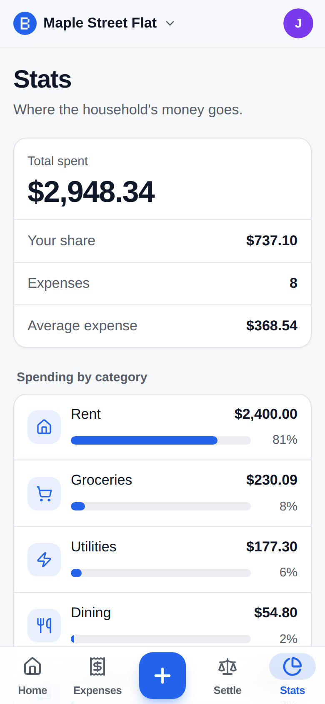
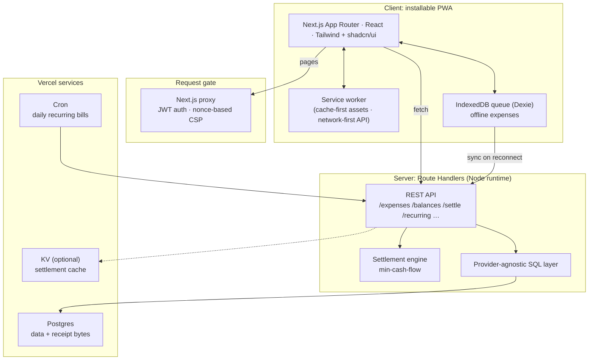

<div align="center">


# BillSpilt

**A roommate bill splitter that installs from the browser, works offline, and settles a household's debts in the fewest possible payments.**

[**Live app: billspilt.com**](https://billspilt.com)


</div>

---

## Demo

<div align="center">

<br/>
<sub>Add an expense, watch the balances update, then settle up. Recorded from a local build with sample data.</sub>
</div>

## Overview

BillSpilt is a full-stack progressive web app for households that share rent, utilities, and groceries. Roommates log expenses, see who owes whom in real time, and settle up through a short list of payments computed by a minimum-cash-flow algorithm. Every feature is free.

It is built mobile-first (44px touch targets, bottom-sheet forms, swipe-to-delete), installs to the home screen without an app store, and keeps working without a network connection. The whole stack runs on free-tier infrastructure: one Postgres database holds the data and the receipt images.

<div align="center">
<table>
<tr>
<td align="center"><br/><sub><b>Balances</b></sub></td>
<td align="center"><br/><sub><b>Add expense</b></sub></td>
<td align="center"><br/><sub><b>Expenses</b></sub></td>
<td align="center"><br/><sub><b>Settle up</b></sub></td>
<td align="center"><br/><sub><b>Stats</b></sub></td>
</tr>
</table>
<sub>Screenshots of the app running locally with sample data, at phone size.</sub>
</div>

## Key features

- **Flexible splits**: equal, exact-amount, or percentage, with remainder cents distributed so every split sums exactly to the total.
- **Instant balances**: your own net position plus pairwise "you owe X" amounts; admins also see every member's net.
- **Minimal settle-up**: debts collapse into a short "A pays B $X" plan, with settlement history and undo. Venmo and Cash App handles are shown with deep links when you owe someone.
- **Recurring bills**: fixed bills (rent, subscriptions) are logged automatically by a daily cron job; variable bills (electric, internet) prompt for the real amount when due.
- **Receipts**: attach a camera photo, library image, or PDF; images are downscaled to 1600px on the client before upload.
- **Households with multiple admins**: rename the household, manage and promote members, regenerate invite codes, settle everyone at once, and review an activity log.
- **One-tap invite links**: logged-in users join instantly from the native share sheet; new users are joined automatically on sign-up.
- **Private amounts**: admins see every figure; everyone else sees only money that is theirs (their share, their balances, payments they are part of). Hidden figures are redacted server-side in `lib/visibility.ts` before the JSON leaves the API.
- **Search, filter, and CSV export**: the full ledger for admins, your own shares for everyone else.
- **Offline-first PWA**: expenses added offline queue locally and sync on reconnect; installable, with dark mode and home-screen shortcuts.
- **Accounts**: credentials sign-up and login with a self-serve email password reset.
- **SEO-ready marketing site**: Open Graph and Twitter cards, a generated 1200x630 social image, JSON-LD structured data, sitemap, robots, and a set of long-form guides.

## Tech stack

| Concern | Choice |
| --- | --- |
| Framework | Next.js 16 (App Router), React 19, TypeScript (strict) |
| UI | Tailwind CSS, shadcn/ui (Radix primitives), Framer Motion |
| Database | PostgreSQL via Neon's serverless HTTP driver or `pg` over TCP, selected by host |
| Validation | Zod |
| Auth | NextAuth.js v5 (Credentials, JWT sessions, bcrypt) |
| Email | Resend or SMTP via Nodemailer (password reset) |
| Cache | Vercel KV (optional; degrades gracefully when absent) |
| Offline / PWA | Serwist service worker, Dexie.js (IndexedDB) |
| Background jobs | Vercel Cron |
| Testing | Vitest |
| Hosting | Vercel |

## Architecture


```mermaid
flowchart TD
    subgraph Client["Client: installable PWA"]
        UI["Next.js App Router · React · Tailwind + shadcn/ui"]
        SW["Service worker<br/>(cache-first assets · network-first API)"]
        IDB["IndexedDB queue (Dexie)<br/>offline expenses"]
        UI <--> SW
        UI <--> IDB
    end

    subgraph Gate["Request gate"]
        PX["Next.js proxy<br/>JWT auth · nonce-based CSP"]
    end

    subgraph Server["Server: Route Handlers (Node runtime)"]
        API["REST API<br/>/expenses /balances /settle /recurring …"]
        SET["Settlement engine<br/>min-cash-flow"]
        DB["Provider-agnostic SQL layer"]
    end

    subgraph Infra["Vercel services"]
        PG["Postgres<br/>data + receipt bytes"]
        KV["KV (optional)<br/>settlement cache"]
        CRON["Cron<br/>daily recurring bills"]
    end

    UI -->|pages| PX
    UI -->|fetch| API
    IDB -->|sync on reconnect| API
    API --> SET
    API --> DB --> PG
    API -.-> KV
    CRON --> API
```

## Engineering highlights

**Settlement as graph reduction.** With *n* roommates there can be up to *n²* pairwise debts. `minimizeTransfers` in [`lib/settlement.ts`](lib/settlement.ts) reduces them to net balances, then repeatedly matches the largest creditor against the largest debtor, producing at most *n − 1* transfers. All arithmetic is done in integer cents to avoid floating-point drift.

**Money that always reconciles.** Splitting $40.00 three ways yields 13.34 / 13.33 / 13.33, not 13.333…. `computeSplits` distributes remainder cents deterministically so parts always sum to the total for equal, exact, and percentage splits, and inputs are validated server-side before anything is written.

**Offline-first writes.** Expenses created offline are stored in IndexedDB and flagged unsynced. An `online` listener and focus revalidation flush the queue, removing each record only after a confirmed 2xx; a request that fails mid-flight falls back to the local queue. An offline banner shows the pending count. See [`lib/sync.ts`](lib/sync.ts) and [`lib/offline-db.ts`](lib/offline-db.ts).

**A data layer that doesn't care who hosts Postgres.** Managed providers disagree on connection semantics (Neon speaks HTTP, others expect TCP). The `sql` helper in [`lib/db.ts`](lib/db.ts) picks a backend from the connection host, using Neon's HTTP driver for `*.neon.tech` and `pg` for everything else, behind a single tagged-template interface. The same build runs on Neon, Prisma Postgres, Supabase, or RDS.

**Atomic writes without interactive transactions.** The HTTP driver runs one statement per request, so there is no `BEGIN`/`COMMIT`. An expense and its splits are written in a single CTE that inserts the expense, returns its id, and fans it out across `jsonb_to_recordset` for the split rows: one round trip, all-or-nothing ([`lib/expenses.ts`](lib/expenses.ts)). Bulk settle-up uses the same technique.

**Receipts without a second storage product.** Receipt images and PDFs are stored in Postgres as `BYTEA`, moving over the wire as base64 so neither driver has to marshal raw binary. They are served from [`/api/receipts/[key]`](app/api/receipts/[key]/route.ts) only to members of the owning household, and the daily cron prunes uploads that no expense ever claimed.

**Auth and security.** NextAuth v5 with bcrypt-hashed passwords and stateless JWT sessions. The request gate in [`proxy.ts`](proxy.ts) is scoped to page routes only (API routes authorize themselves and return JSON 401s instead of HTML redirects) and sets a strict, per-request nonce Content-Security-Policy with `'strict-dynamic'`. All queries are parameterized, the schema bootstraps itself idempotently on first request, and the cron endpoint requires a bearer secret.

**Operational visibility.** `/api/health` reports whether login and password reset are actually ready (database reachable, auth secret present, email provider accepting credentials), and email-provider failures are recorded in the database so every instance sees them.

## Getting started

Requires Node.js and a PostgreSQL connection string.

```bash
git clone https://github.com/taylordrew4u2/Bill-Spilt.git
cd Bill-Spilt
npm install
cp .env.example .env.local   # then fill in POSTGRES_URL, AUTH_SECRET, etc.
npm run dev                  # http://localhost:3000
```

The schema is created automatically on first request. The service worker is disabled in development; PWA behavior is active in production builds.

| Command | Purpose |
| --- | --- |
| `npm run dev` | Start the development server |
| `npm run build` / `npm start` | Production build and server |
| `npm run lint` | ESLint |
| `npx tsc --noEmit` | Type-check |
| `npm test` | Run the Vitest suite |
| `npm run icons` | Regenerate PWA icons (dependency-free generator) |

Environment variables, Vercel deployment, the health endpoint, and recovery scripts (`set-password`, `migrate-receipts`) are documented in [docs/operations.md](docs/operations.md).

## Testing

Unit tests use Vitest and live beside the code they cover (`lib/**/*.test.ts`, `app/**/*.test.ts`). They cover split and settlement math, credential handling, Venmo and Cash App deep links, receipt storage round-trips, email-provider health, and the forgot-password route.

```bash
npm test
```

## Project structure

```
app/
  (auth)/                 Login, register, forgot and reset password
  (app)/                  Home, expenses, settle, and stats tabs
  api/                    REST route handlers (Node runtime)
  join/[code]/            One-tap invite entry
  guide/                  Long-form SEO guides
  sw.ts                   Service worker (Serwist)
components/               Feature components; ui/ holds shadcn/ui primitives
lib/
  settlement.ts           Min-cash-flow and split math
  db.ts                   Provider-agnostic SQL layer and schema bootstrap
  expenses.ts             Atomic expense + splits write
  queries.ts              Read models and balance aggregation
  visibility.ts           Who may see which amount (server-side redaction)
  receipts.ts             Receipt storage, retrieval, and pruning
  offline-db.ts, sync.ts  IndexedDB queue and sync
proxy.ts                  Auth gate and Content-Security-Policy
scripts/                  Icon generator, password reset, receipt migration
docs/                     Operations guide, screenshots and demo, launch copy
```

## Author

Built by [@taylordrew4u2](https://github.com/taylordrew4u2).

## License

Free to use. No formal open-source license file is included yet.
